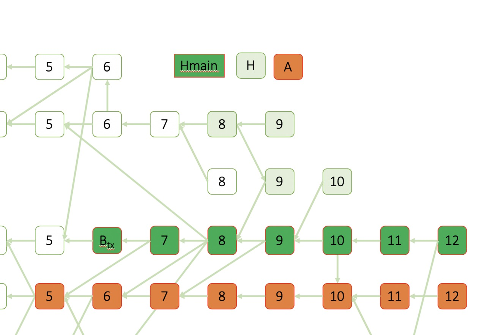

> Source: https://www.cs.huji.ac.il/~yoni_sompo/pubs/15/inclusive_full.pdf

# 3 Security

# 3 安全

The original security analysis of Satoshi ([10]), as well as analysis done by others
[12, 13], has considered the probability of a successful double-spend attack
under the regular non-inclusive scheme. An alternative analysis may instead
measure the cost of the attack rather than their success probability (both have
been analyzed in [12]).

中本聪（[10]）最初的安全分析，
还有一些其他人的分析[12, 13]，
已经考虑了常规的非Inclusive体制下一个双花攻击成功的概率。
还有一种分析方式是衡量攻击的成本，
而非它们的成功概率（[12]对这两种方式都做了分析）。

Below we prove that the Inclusive version of the protocol is at least as secure
as the non-inclusive one, in terms of the probability of successful attacks. In
addition, we show that the cost of an attack under Inclusive can be made high,
by properly modifying the acceptance policy.

下面来证明Inclusive版本的协议在攻击成功概率上的安全性不会低于非Inclusive的版本。
另外我们还会说明，
Inclusive可以通过修改接受策略使一次攻击的成本变高。

## 3.1 Acceptance Policy

## 3.1 接受策略

The recipient of a given transaction observes the network’s published blocks,
and needs to decide when to consider the payment “accepted”, that is, when it
is safe to release the goods or services paid for by the transaction. He does so by
making sure his transaction is included and confirmed by the main chain, and
calculating the probability that it would be later excluded from it.

一个给定交易的接收方会观察网络中已经发布的区块，
并需要决定何时考虑“接受”付款，
也就是说，
何时为已付款的交易释放产品或服务才是安全的。
他要确保他的交易被主链所包含和确认，
并计算交易以后被剔除的概率。

**Probability of Successful Attacks** We now compare the probability of a
successful attack under the regular longest-chain protocol to the one under its
Inclusive version. Our method can apply to other main chain rules as well (e.g.,
GHOST). Recall that under Inclusive the blocks form a DAG, whereas when
Inclusive is not implemented they form a tree (see Sect. 2). Notice that if
G(t) is the block DAG at time t then if the network would have followed the noninclusive
setup, its block tree T(t) would be precisely the subgraph of
G(t) obtained by removing all edges in blocks’ reference list apart from the main
edges (i.e., the first pointer in every block). For any DAG
G let F(G) be its main chain according to the underlying selection rule
F (G can also be a tree).

**攻击成功的概率**
现在比较在常规最长链协议下与在Inclusive版本下的攻击成功概率。
这个方法也可以应用于其他主链规则（例如GHOST）。
回顾一下，
在Inclusive下，
区块形成一个有向无环图；
而当Inclusive没有被实现时它们形成一棵树（见第2节）。
注意，
如果G(t)是处于时刻t的区块图，
那么如果网络遵循的是非Inclusive规则，
它的区块树T(t)正好就是移除区块引用列表中除主边（即每个区块中的第一个指针）以外的所有边而得到的G(t)的子图。
对于任意一个有向无环图G，
令F(G)为根据基础选择规则F得到的主链（G也可以是一棵树）。

**Theorem 2.** Let G(t) be the block DAG at time t, and let T(t) be the block
tree that is obtained from G(t) by discarding the non-main edges. For any block
B ∈ F(G(t)),

**定理2：**
设G(t)为时刻t的区块图，
并设T(t)为丢弃非主边从而由G(t)得到的区块树。
对任意B ∈ F(G(t))，

&space;t:&space;\Pr(B&space;\notin&space;F(G(s)))&space;=&space;\Pr(B&space;\notin&space;F(T(s)))&space;\hfill&space;(2)" title="\forall s > t: \Pr(B \notin F(G(s))) = \Pr(B \notin F(T(s))) \hfill (2)" />

*Proof.* This is immediate from the fact that Inclusive does not change the way
the main chain is selected, therefore, for all s: F(G(s)) = F(T(s)). 
&#9744;

*证明：*
从Inclusive并不改变主链挑选方式的事实可以立即得出该结论。
因此对于所有的s都有：
F(G(s)) = F(T(s))。
&#9744;

As a corollary, the probability that a transaction would be excluded from the
main chain does not become higher under Inclusive, as the security guarantees
of main chain blocks apply to individual transactions as well (see the discussion
succeeding Algorithm 1). In particular, any acceptance policy employed by a
recipient of funds in a network following a non-inclusive protocol (see, e.g., [10,
12, 13]) can be safely carried out when Inclusive is implemented.

作为推论，
在Inclusive下一笔交易被排除在主链以外的可能性不会变得更高，
因为对主链区块的安全保证同样也适用于单笔交易（请参见算法1后面的讨论）。
【译注：
这里“算法1后面的讨论”具体应该是指第二章中命题（Proposition）1后面的一段话，
原文是
“An important property of this protocol is that once a transaction has been
approved by some main chain block B of G, it will remain in the approved set of
any extending block as long as B remains in G’s main chain...”，
译文是
“该协议的一个重要特性是，
一旦交易被G的某个主链区块B接受，
只要B保留在G的主链中，
该交易就会保留在任何B的扩展块的接受集中……”】
尤其是，
当Inclusive被实现的时候，
遵循非Inclusive协议
（例如，参见[10、12、13]）
的网络中的资金接受者所采用的任何接受策略都可以安全地被执行。

**Cost of Attacks** As mentioned at the beginning of this section, one may be
interested in measuring the cost of a double-spend attack rather than its success
probability. A potential drawback of including transactions from off-chain blocks
is that it mitigates the cost of a failed double-spend attack. Double spend attacks
consist typically of chains constructed by the attacker that are initially kept
secret. The construction of blocks requires computational resources. Under the
non-inclusive setup, when the attacker withdraws from the attack (usually after
failing to build blocks faster than the network), its blocks are discarded. In
contrast, under the Inclusive protocol, the attacker may still publish its secret
chain and gain some value from transactions contained inside.

**攻击成本**
如本节开头所述，
人们可能对双重花费攻击的成本而不是其成功率更感兴趣。
不剔除链下区块的交易的一个潜在缺点是它会减轻双花攻击的失败成本。
双花攻击通常来自攻击者构建的最初是秘密的链。
区块的构建需要计算资源。
在非Inclusive的设置中，
当攻击者撤回攻击时
（通常是在无法比网络更快地构建区块之后），
其区块将被丢弃。
相反，
在Inclusive协议下，
攻击者仍旧可以发布其秘密链并从其中所包含的交易获得一些收益。

However, the recipient of funds can cancel this effect by waiting longer before
accepting the payment. Indeed, if the attacker is forced to create long secret
chains, its blocks suffer some loss due to the lower reward implied by the function
γ(·).

但是，
资金的接收者可以在接受付款之前等待久一些从而抵消这种效果。
的确，
如果攻击者被迫制造很长的秘密链，
那么由于函数γ(·)暗含着更低的报酬，
其区块就会遭受一些损失。

To formalize this we provide first some definitions and notations. Denote by
G(t) the published developing block DAG at time t, and assume some main chain
block Btx confirms the transaction tx (that is, tx ∈
Inclusive-F(G(t),Btx, ∅)).  Let H(t) ⊆ G(t) be the set of blocks
from which Btx is reachable, and denote the main chain atop
Btx (including itself) by Hmain(t) ⊆ H(t). Let A(t) ⊆
G(t) \ H(t) be the set of blocks which satisfy post(·) ≻ Btx; these are blocks
which can be used by the attacker to reverse the transaction (even though the
attacker did not necessarily create all of them), and the requirement on their
post(·) block is to exclude from this set blocks earlier than Btx,
under the order of G (which do not affect the resolution of future conflicts).

为了对此进行形式化说明，
我们首先提供一些定义和符号。
定义G(t)为在时间t发布的正在增长的区块图，
并假设主链上的某个区块Btx确认了交易tx
（即 tx ∈ Inclusive-F(G(t),Btx,∅)）。
令H(t) ⊆ G(t)为可到达Btx的一组区块
【译注：即H(t)是Btx的后裔】，
并令Hmain(t) ⊆ H(t)表示Btx之上的主链
（包括Btx自身）。
设A(t) ⊆ G(t) \ H(t) 是满足post(·) ≻ Btx的区块集；
这些是攻击者可以利用来撤消该笔交易的区块
（即使它们并不一定全是由攻击者创建的），
并且对它们的post(·)有要求
【译注：即要求post(·) ≻ Btx】
是为了从这个集合
【译注：即A(t)】
中剔除G顺序下排序早于Btx的区块
（因为它们对将来解决冲突不会施加影响）。

---

#### 译注

下面这幅图是上面一段话定义的一堆符号的一个例子。

---

Denote by val the expected reward from a block, under the Inclusive reward-scheme.
val is equal, in equilibrium, to the expected cost of creating a block.
We will simplify our analysis by assuming that val is constant. Finally, for convenience,
we analyze the case where the underlying chain selection rule (F) is
GHOST; the results apply to the longest-chain rule as well, after some slight
changes.

用val表示Inclusive奖励方案下一个区块的预期奖励。
val与区块创建的预期成本保持平衡。
我们将假定val为常数从而简化分析过程。
最后为方便起见，
我们假设底层的链选择规则（F）为GHOST;
分析结果在稍加调整后也适用于最长链规则。

---

#### 译注

关于奖励与成本之间的平衡关系，
可以参考《[区块链：技术驱动金融](https://www.amazon.cn/dp/B073QHSM7P/)》的第2.5节，
其中提到：

>我们预计矿工们会处在经济平衡点附近，
>意味着他们得到的奖励大致等于他们在硬件与电费上的花费。
>理由是如果一个矿工持续亏钱，
>他会停止挖矿。
>反之，
>如果硬件和电费固定的情况下，
>挖矿利润很高，那
更多的挖矿设备会加入网络。
>计算能力的增加会导致难度提高，
>每个矿工预期的回报便会降低。

equilibrium的意思是“平衡”而非“等价”。
收益和成本不一定相等，
但是从长期看它们会趋于大致相等。
下文引理3的证明中对受益的描述是“最多”，
而对成本的描述是“最少”也可以从侧面解释这个词的含义。

---

**Lemma 3.** Assume the attacker holds a fraction of at most q of the computational
power. If |Hmain(t)| = n, |A(t)| = m, and the attacker has created k secret
blocks, then the cost of a failed attack satisfies

**引理3：** 
假定攻击者最多持有算力的一部分，
比例为q。
如果|Hmain(t)| = n，
|A(t)| = m，
并且攻击者创建了k个秘密区块，
那么一次失败攻击的成本满足

*Proof.* In the best case for the attacker, its blocks form a chain which is
built atop A(t). If Ah is its h-th block (1 ≤ h ≤ k) then
pre(Ah).height < Btx.height - 1 + m + h, or otherwise
Ah necessarily references a block in Hmain as its main
parent (recall that a block’s ordered reference list is forced to agree with
F), and in particular it supports tx and does not participate in the attack.

*证明：*
在对攻击者最有利的情况下，
其区块形成一条构建在A(t)之上的链。
如果Ah是其第h个块（1≤h≤k）
【译注：这里指Ah是构建在A(t)之上的k个秘密区块中的第h个。
注意Ah不在A(t)中，
因此它的高度可能会大于Btx】，
则pre(Ah).height < Btx.height - 1 + m + h，
否则Ah一定会引用Hmain中的一个区块作为其主父亲
（回想一下，某个区块的有序引用列表必须与F一致
【译注：这里指的是在一个区块的所有父亲中，
主链上的父亲必须排在其它父亲前面。
这句话解释了什么是“主父亲”。】），
那样它就会支持tx，
不参与攻击。

In addition, the attacker’s secret blocks are not published before the acceptance,
hence their post(·) block height is at least Btx.height + n. We conclude
that the discount parameter on Ah is at most

此外，
攻击者的秘密区块在tx被接受之前不会发布，
因此它们的post(·)区块的高度至少为Btx.height + n。
于是可以得出结论，
Ah的折扣参数最多为

hence its cost is at least (1 − γ(n + 2 − m − h))·val. After a change of parameter
we arrive at (3).
&#9744;

因此，其成本至少
【译注：至少从长期来看，
也就是说当系统运行了很长时间，
奖励和成本大致相等的时候】
为(1-γ(n + 2 - m - h))·val。
更改参数后即可得出(3)。
&#9744;

We now make use of this result to show that a payee that follows the acceptance
policy introduced in [13] can make the attack cost arbitrarily high by
waiting sufficiently before acceptance.

现在我们使用此结果来表明，
收款人通过遵从[13]中引入的策略，
在接受付款之前等待足够长的时间，
可以使攻击成本变得任意高。

**Corollary 4.** Let tx be a transaction in G(t), and assume an attacker builds
a secret chain that does not confirm tx, and that it persists with its attack as
long as the payee has not approved the transaction. Then the minimal value
of the double-spend needed for the attack to be profitable in expectation grows
exponentially with t.

**推论4：**
假设tx是G(t)中的交易，
并假设攻击者建立了不确认tx的秘密链，
并且只要收款人未批准交易，
这条链就一直持续构建下去。
那么攻击行为期望获利的话，
其需要的双重花费最小值与t成指数关系。
【译注：换个角度理解，
如果作为攻击目标的tx本身涉及的金额很小，
也就说双重花费的金额很小，
而攻击成本又很大的话，
tx就没有攻击价值。】

*Proof.* Let |Hmain(t)| = n, |H(t)| = N, and |A(t)| = m. The probability that
an attacker with a fraction q < 0.5 of the computational power has managed
to create k secret blocks is at most

, where t0 is the time it began its attack. Following the dynamics
of GHOST, the payee can wait for a collapse to occur, i.e., for Btx to be
included in the main chain of all honest nodes. Consequently, the probability
that the attack will be successful is upper bounded by

. Here we used a worst-case assumption, according to which the attacker is able
to exploit all of the blocks in A(t) for its attack.

*证明：*
令|Hmain(t)| = n，|H(t)| = N，|A(t)| = m。
算力比例q < 0.5的攻击者创建了k个秘密区块的最大概率是

【译注：这是[泊松分布](https://zh.wikipedia.org/wiki/%E6%B3%8A%E6%9D%BE%E5%88%86%E4%BD%88)的概率质量函数】，
其中t0是攻击的开始时间。
收款方可以遵循GHOST的动态，等待坍塌发生，
也就是等待Btx被所有诚实节点的主链接受。
因此，攻击成功的概率上限是

。【译注：该公式的推导可参考比特币白皮书，即[10]。
另外注意这里指数是(N+1-m-k)+而不是(n+1-m-k)+ 。
这是因为GHOST并不依靠链的长度来抵御双花攻击。
在GHOST规则下，攻击者构造的区块数量必须超过以Btx为根区块的子树的区块数量
（严谨地说应该是整个子树的挖矿难度总和），系统才会接受攻击者的区块。】
这里我们假设的是最坏情况，
也就是说攻击者能够将A(t)里的所有区块用于攻击。

In case of a successful attack the attacker profits the amount double-spent,
which we denote DS, while the profit from its blocks is offset by their creation
costs. On the other hand, the cost of a failed attack is given by (3). Calculating
the attack cost, we arrive at:

如果攻击成功，则攻击者获得双重花费的金额。
我们将其表示为DS。与此同时区块获得的利润会被区块创建的成本所抵消。
另一方面，攻击失败的代价由(3)给出。通过计算攻击代价，可以得出：

【译注：上面这条不等式是攻击代价减去攻击收益，也就是攻击者在任意情况下亏本额度的期望值。】

For a given time t, there is a probability distribution over DAGs that will be
created by the network. This induces random variables for N = N(t), n = n(t),
and m = m(t). As t grows these become arbitrarily close to their expected values
(by the Law of Large Numbers). We can thus replace N with its expectation
(1−q)λ·t, and notice that E[n] grows with time and E[m] approaches a constant.
Isolating DS shows that its minimal value in order for E[attack-cost] to be nonpositive
grows exponentially with t (assuming γ is non-trivial, that is, γ &nequiv; 1).
&#9744;

对于给定的时间t，网络所创建的有向无环图上存在一个概率分布。
这就有了随机变量N = N(t)，n = n(t)和m = m(t)。
随着t的增长，它们会无限接近其期望值（根据大数定律）。
因此，可以用期望值(1-q)λ·t代替N，并注意E[n]随着时间增长，而E[m]近似常数。
将DS取出来，就可以得出，
为了使E[attack-cost]为非正数所需要的DS的最小值随t呈指数增长（假设γ不可忽略，即γ ≢ 1）。 ☐

To illustrate the growth of the attack cost, we show in Table 1 the minimal
double-spend needed in order for an attack to be profitable in expectation. The
table entries admit to the minimal DS making the attack profitable; here we
fixed N and averaged over t (in contrast to the previous corollary). In addition,
for simplicity we assumed m = 0 and n = N, corresponding to the case where
the honest network suffers no delays. The penalty function γ0 was selected as
the one from Example 1, and the expected reward from a block were normalized
so that val = 1. Notice that waiting for only one or two blocks is not safe at
all, as the attacker can easily afford to try and create longer chains under the
function γ0 that we have chosen.

为了说明攻击成本的增长，我们在表1中展示了为了使攻击在期望上获利所需的最小双重花费。
表的条目就是使攻击获利的最小DS； 在这里，我们固定N并取t的平均值
（与之前的推论相反【译注：之前的推论4是固定t，取N在t上的期望值】）。
此外，为简单起见，我们假设m = 0和n = N，即诚实节点的网络不受任何延迟。
惩罚函数γ0采用例1的定义，并对一个区块的预期回报进行了归一化，
因此val = 1。请注意，仅等待一两个块根本不安全，
因为攻击者在我们选择的函数γ0下可以轻松尝试创建更长的链。

**Table 1.** The minimal double-spend (normalized by blocks’ expected rewards, val)
needed in order for an attack to be profitable in expectation, as a function of the
number of confirmations and the attacker’s computational power.

**表1：** 为了使攻击在期望上获利所需要的最小双重花费
（按区块的预期奖励val标准化）。这个花费取决于确认数
【译注，即N，也就是表中第一行的1至10】和攻击者的计算能力。

|q|1|2|3|4|5|6|7|8|9|10|
|-|-|-|-|-|-|-|-|-|-|--|
|2%|0|0|9.3 &middot; 102|1.2 &middot; 105|1.1 · 107|8.3 · 108|5.8 · 1010|3.8 · 1012|2.4 · 1014|1.3 · 1016|
6%|0|0|79|3.1 · 103|8.7 · 104|2.1 · 106|4.5 · 107|9.1 · 108|1.8 · 1010|2.9 · 1011|
10%|0|0|22|4.8 · 102|7.5 · 103|9.9 · 104|1.2 · 106|1.4 · 107|1.5 · 108|1.4 · 109|
14%|0|0|8.5|1.3 · 102|1.3 · 103|1.2 · 104|9.4 · 104|7.1 · 105|5.1 · 106|3.2 · 107|
18%|0|0|4.0|44|3.3 · 102|2.1 · 103|1.2 · 104|6.8 · 104|3.6 · 105|1.6 · 106|
22%|0|0|2.0|18|1.0 · 102|5.1 · 102|2.3 · 103|9.7 · 103|3.9 · 104|1.4 · 105|
26%|0|0|1.1|7.9|37|1.5 · 102|5.3 · 102|1.8 · 103|5.7 · 103|1.6 · 104|
30%|0|0|0.63|3.8|15|49|1.4 · 102|4.0 · 102|1.0 · 103|2.4 · 103|
34%|0|0|0.36|1.9|6.4|18|45|1.0 · 102|2.3 · 102|4.6 · 102|
38%|0|0|0.20|0.92|2.8|6.9|15|30|58|1.0 · 102|
42%|0|0|0.10|0.43|1.2|2.6|5.2|9.3|16|25
46%|0|0|04|0.16|0.40|0.82|1.5|2.5|3.9|5.6
50%|0|0|0|0|0|0|0|0|0|0

The results above are not quite satisfying, as they demonstrate only the costs
of an attack from a specific class: We assumed the attacker does not withdraw
before the payee’s acceptance. One could consider more sophisticated attack
policies in which the attacker might withdraw earlier in order to reduce costs. The
main obstacle here, is that there exist selfish mining strategies in which a miner
profits from withholding some of his blocks, even under the non-inclusive setup
([7]). We point out that a malicious miner can execute double-spend attacks
while employing selfish mining strategies, thereby guaranteeing itself an expected
positive profit. While Inclusive protocols reduce the cost of a failed attack, we
conjecture that adequate acceptance policies cancel this effect (as we have shown
in Corollary 4 for one attack profile).

上面的结果并不令人满意，因为它们仅显示了来自特定类别的攻击的成本：
我们假设攻击者在收款人接受之前不会撤销攻击。作恶者可以考虑采用更复杂的攻击策略，
在这种策略中，攻击者可能会提前撤出以降低成本。这里的主要问题是，存在自私的采矿策略，
使得即使在非Inclusive设置下，矿工也可以通过撤除他自己的一些区块从而获利（[7]）。
恶意矿工可以采用自私的挖矿策略的同时执行双花攻击，从而保证在期望上能获得正收益。
尽管Inclusive协议降低了失败攻击的成本，
但我们推测适当的接受策略可以消除这种影响
（如推论4中针对某种攻击形式所展示的接受策略）。

## 3.2 Delayed Service Attack

## 3.2 延迟服务攻击

Another possible form of an attack is that of delayed service. The acceptance
policy described above implies that if a recipient of a payment observes many
blocks in the DAG that have the potential to form a competing main chain
that will not accept his transaction, it must delay acceptance. Consequently,
an attacker may decide to create its blocks deliberately off-chain, in attempt to
increase the waiting time for transaction authorization in the network.

还有一种可能的攻击形式是延迟服务。上述接受政策暗示着，
如果付款的接收者发现DAG中有很多区块可能形成不接受其交易的竞争性主链，
则它必须延迟接受。因此，攻击者可能会决定故意在链外创建区块，
以尝试增加网络中交易授权的等待时间。
【译注：有点类似网络攻防中的拒绝服务攻击（DDoS）。】

Notice that the attacker can never profit from a delayed service attack, say
by reversing a previous payment, as its attack blocks are immediately published
and are therefore transparent to any transaction authorizer. Moreover, the longer
the attack goes on the greater its cost, as the gap between the post(·) and pre(·)
of the participating blocks grows larger.

请注意，攻击者永远无法通过比如说冲销先前的付款，从而从延迟服务攻击中获利。
这是因为攻击区块会立即发布，对任何交易授权者都是透明的。
此外，攻击持续的时间越长，参与攻击的区块的post(·)和pre(·)之间的距离就越大，
攻击成本就越高。【译注：也就是说延迟服务攻击是一种损人不利己的行为。】

Assume the attacker wishes to delay the confirmation of transactions that
lie in some block B. This can be done by increasing |A(t)| = m, that is, by
publishing blocks from which B is not reachable. Despite the threat from A(t),
the honest network may add enough blocks to H(t) for these transactions to be
accepted.

假设攻击者希望延迟某个区块B中的交易的确认。
这可以通过增加|A(t)| = m，即通过发布不可访问B的区块来实现。
尽管有来自A(t)的威胁，诚实网络仍可以向H(t)添加足够的块以接受这些交易。

We simulated this attack on a network with 100 equal miners, a delay of 2
seconds between each two, and a creation rate of 1 block per second. Figure 1
depicts the (fraction of) computational power needed by an attacker as a function
of the increase in waiting time it aims to induce. The payees are assumed to use
the policy induced by (4), with q = 0.2, and DS at most 1000 · val.

我们在具有100个对等矿工的网络上模拟了这种攻击，
每对矿工之间的延迟为2秒，出块速度为每秒1个区块。
图1描绘了攻击者所需的计算能力（比例）和等待时间的增加之间的关系。
假定收款人使用由(4)诱导的策略，q = 0.2，DS最高为1000 · val。

**Fig. 1.** The fraction of computational power an attacker needs to hold as a function of
the increase in waiting time it aims to induce.

**图1：** 攻击者需要持有的计算能力的比例随着等待时间的增加而变化。

# References

[7]. Eyal, I., Sirer, E.G.: Majority is not enough: Bitcoin mining is vulnerable. In:
Financial Cryptography and Data Security, pp. 436–454. Springer (2014)

[10]. Nakamoto, S.: Bitcoin: A peer-to-peer electronic cash system (2008)

[12]. Rosenfeld, M.: Analysis of hashrate-based double spending. arXiv preprint
arXiv:1402.2009 (2014)

[13]. Sompolinsky, Y., Zohar, A.: Secure high-rate transaction processing in Bitcoin. In:
Financial Cryptography and Data Security. Springer (2015)
