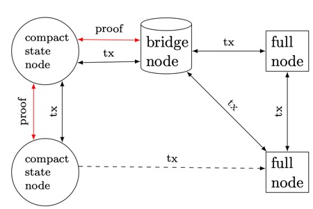

> Source: https://eprint.iacr.org/2019/611.pdf
# 4 Dynamic Accumulator
# 4 动态累加器

We introduce a hash-based dynamic accumulator with no trusted setup or manager requirements.
Introduced in [6], accumulators are compact representations of a set, to which elements can be added and proven.
Our accumulator uses a forest of perfect Merkle trees [7] and extends the work of [8] to allow efficient removals of elements from the accumulator, reducing the total number of leaves in the forest when deletions occur.

接下来我们会介绍一个没有信任设置或管理器要求的基于哈希的动态累加器。
累加器是在[6]中引入的，它能以紧凑的方式表示一个集合，
并可以向集合中添加元素和证明元素在集合中是否存在。
我们的累加器则使用了完美默克尔树[7]组成的森林，
并扩展了[8]的工作，使得从累加器中删除元素的操作更高效，
减少了删除时森林中的叶子总数。

Additions are computable without any data beyond the accumulator and the element to be added, and deletions are computable with an inclusion proof of the data to be deleted.

添加操作不会涉及累加器和需要添加的元素以外的数据，
删除操作则需要证明待删除元素被包含在累加器中。

The design of the accumulator is a forest of perfect binary hash trees.
The representation of the accumulator which must be stored includes: the number of elements stored, and the root of every tree in the forest.

我们将累加器设计为完美二叉哈希树组成的一个森林。
累加器必须存储的数据包括：已存储的元素数目以及森林中每棵树的根。

To update the accumulator, Add(), Delete() and Verify() functions are defined, which each operate on single elements.
Batched operations, where multiple elements are added or removed at the same time can speed up operations and reduce the sizes of proofs.

为了更新累加器，我们定义了Add()，Delete()和Verify()函数用于操作单个元素。
批处理操作（同时添加或删除多个元素）可以加快操作速度并减小证明的大小。

## 4.1 Logical structure of the binary forest

## 4.1 二叉森林的逻辑结构

We arrange the elements of the accumulator into a forest of perfect binary trees with the largest tree on the left and smallest on the right.
This arrangement allows for a more intuitive visualization of trees merging and splitting when needed.
Row operations are also possible where elements can move between sub-trees.

我们将累加器的元素排列成由完美二叉树组成的一个森林，其中最大的树在左侧，最小的树在右侧。
这种排列可以在需要时更直观地将树的合并和分裂可视化。
当我们在子树之间移动元素时，还可以进行行操作。

 As the trees in the forest are always perfect, they hold 2<sup>h</sup> leaves, where h is the height of the tree.
Any natural number of leaves can be organized into a forest of perfect binary trees, just as any natural number can be represented by a sum of powers of two.
This relation provides a convenient shortcut: the number of trees in the accumulator is the number of 1-bits in the binary representation of the number of leaves.
The heights of those trees is the bit-position of the 1-bits in that representation.
For example, a forest with 133 leaves would have 3 trees: a height 7 tree, a height 2 tree, and a height 0 tree.
This is quickly visible by looking at the binary representation of the number 133: 10000101.

由于森林中的树都是完美的，因此它们都拥有2<sup>h</sup>个叶子，其中h是树的高度。
任意自然数数量的叶子都可以组织成完美的二叉树森林，就像任何自然数可以由2的乘方之和表示。
这种关系提供了一个方便快捷的思路：累加器中树的数量就是叶子数量的二进制表示形式中1的个数。
这些树的高度就是叶子数量二进制表示形式中相应的1的比特位置。
例如，一个有133个叶子的森林会有3棵树：
一棵高度为7的树，一棵高度为2的树和一棵高度为0的树。
通过查看数字133：10000101的二进制表示，可以很快看到这一点。

Any set of leaves can be grouped into binary trees using this method.
In all cases, it is possible to add one more leaf to the forest knowing only the roots of each tree.
In the 133 leaf example, adding an extra leaf would result in 134 leaves, with a binary representation of 10000110.
The 0-height tree (which itself is a leaf) would combine with the newly added leaf to create a 1-height tree with 2 leaves.
A further addition to 135 would then create a 0-height tree with the additional leaf.

可以使用此方法将任意一堆叶子按组划分为多棵二叉树。
无论在什么情况下，都可以向森林中添加一个叶子，而只需知道每棵树的根。
在133个叶子的示例中，添加一个额外的叶子将得到134个叶子，二进制表示为10000110。
高度为0的树（其本身就是一个叶子）将与新添加的叶子结合，创建出高度为1的树，其中新树含有2个叶子。
然后，再加一得到135的话将会又创建一棵高度为0的树，新树本身就是新添加的叶子。

## 4.2 Adding and removing elements

## 4.2 添加和删除元素

We describe here how to add or remove a single element, which suffices for all operations as these algorithms can be invoked many times to add or remove many elements.
In the case of removing elements, batching many removals into a single operation can significantly reduce CPU usage.
The batch operation is described with examples in the appendix.

现在描述如何添加或删除单个元素。通过多次调用这两个操作可以添加或删除多个元素。
在删除元素的情况下，将多个删除项合并到一个操作中批量处理可以显著减少CPU使用率。
本文附录通过示例描述了如何执行批处理操作。

The Parent() function, used below, is the typical concatenate and hash function from Merkle trees; we append the height within the tree to prevent attacks such as in [9].
To simplify the pseudocode, this height argument is left out of the Parent() function call, as well as the left / right information in DeleteOne(), which can be obtained from the proof argument.

下面使用的Parent()函数是默克尔树中使用的典型的拼接哈希函数；
我们将树的高度记树中以防止诸如[9]中的攻击。
为了简化伪代码，我们会高度参数从Parent()函数调用中去除，
另外也会将左/右信息（可从证明参数中获得）从DeleteOne()函数调用中去除。

We represent the accumulator’s Merkle forest roots as an array of hashes, which can include empty hashes.
acc[n] is the root at index n, or ∅ if that index is unpopulated (if there is no tree of that height).

我们将累加器的默克尔森林的根表示为一个哈希数组，其中可能包含空哈希。
acc[n]是第n个位置的根【译注：也就是高度为n的树的根】，
如果该位置未填充（即如果没有该高度的树），则为∅。

### **Algorithm 1** AddOne

### **算法1** AddOne

```
1: function AddOne(acc, leaf)  # add a leaf to the accumulator
                               # 往累加器添加一个叶子
2:  n ← leaf  # n is initially the leaf to add
              # n一开始是待添加的叶子
3:  h ← 0  # height is initially 0
           # 高度一开始是0
4:  r ← acc[h]  # r is the lowest root
                # r一开始是最低的根
5:  while r != ∅ do  # loop until an empty root
                     # 一直循环到根为空为止
6:      n ← Parent(r, n)  # 【译注：为r和n创建一个共同的父亲，并将该父亲赋值给n】
7:      acc[h] ← ∅ 
8:      h ← h + 1 
9:      r ← acc[h] 
10: acc[h] ← n 
11: return acc
```

AddOne() takes in the accumulator roots and an element to add.
It continues to compute parents until it encounters the first unpopulated space in the accumulator array, at which point it stores the output of the final parent function and returns a new list of hashes.
This new list can have one more populated hash (in the case where index 0 was empty), the same number, or fewer, down to a single element.

AddOne()接受累加器的根数组和要添加的元素。
它持续创建父亲，直到遇到累加器数组中的第一个未填充的位置，
然后将最后一个Parent()函数的输出存储到未填充的位置并返回一个新的哈希列表。
这个新列表可以包含一个以上被填充的哈希（在索引0为空的情况下），
或者相同或更少的数目，少至只有单个元素。

### **Algorithm 2** DeleteOne

### **算法2** DeleteOne

```
1: function DeleteOne(acc, proof)  # Delete leaf from the accumulator 
                                   # 从累加器删除叶子
2:  n ← ∅ 
3:  h ← 0 
4:  while h < len(proof) do  # Iterate over each proof element 
                             # 遍历每个证明元素
5:      p ← proof[h] 
6:      if n != ∅ then 
7:          n ← Parent(p, n) 
8:      else if acc[h] = ∅ then 
9:          acc[h] ← p 
10:     else 
11:         n ← Parent(p, acc[h]) 
12:         acc[h] ← ∅ 
13:     h ← h + 1 
14:  acc[h] ← n 
15:  return acc
```

DeleteOne() takes in the accumulator roots and an inclusion proof of the element to be deleted.
The inclusion proof is also a list of hashes, along with a position index indicating which proof elements are right and which are left Parent() arguments.
As in AddOne(), it begins with the smallest trees in the array, moving to larger trees, increasing height at each step.
The loop runs through every element of the proof, consuming a proof element at every step, and returning a modified array of roots when done.

DeleteOne()接受累加器里的根以及要删除的元素的包含证明。
包含证明也是一个哈希表，另外还携带一个位置索引。
该位置索引指示哪些证明元素是Parent()的右参数，哪些是Parent()的左参数。
【译注：这个位置索引指示的是待删除的叶子在所有的叶子中排第几位。
证明元素则是待删除的叶子归属于其所在默克尔树的存在证明，
也就是从叶子节点一路向上遍历到根节点路上的兄弟节点。这些节点本身也是哈希。
根据4.1节描述的累加器内部逻辑结构，因为累加器中每棵默克尔树都是完美二叉树，
所以只要得知累加器的根数组和待删除的叶子在所有叶子中的位置索引，
我们就能在这个向上遍历的过程中得知这些兄弟节点（也就是证明元素）是其父节点的左孩子还是右孩子。
可以详细参见下面译注中给出的DeleteOne()演算例子。
算法2给出的DeleteOne并没有使用这个位置索引，但是出于安全考虑，
实际生产环境中的代码需要使用该位置索引和待删除叶子的哈希对证明元素做验证。】
与AddOne()一样，它从数组中最小的树开始，然后移动到更大的树，并在每一步增加高度。
while循环遍历证明里的每个元素，在每个步骤中消耗一个证明元素，并在完成后返回修改后的根数组。

---

#### 译注

这里以一个例子来具体说明DeleteOne()的参数和演算流程。

假设累加器含有14个叶子，分别是H(A)至H(N)。
根据4.1节的描述，14的二进制形式是1110，
因此累加器中应该有3棵默克尔树，分别在根数组的位置3、2、1上；位置0的根为空；如下。

```
             H(ABCDEFGH)                    H(IJKL)         H(MN)    ∅
            /          \                   /      \        /    \
      H(ABCD)           H(EFGH)         H(IJ)      H(KJ)  H(M) H(N)
     /      \           /      \        /   \     /    \
  H(AB)     H(CD)     H(EF)    H(GH)   H(I) H(J) H(K) H(J)
 /   \     /    \    /   \    /    \
H(A) H(B) H(C) H(D) H(E) H(F) H(G) H(H)
```

初始传入DeleteOne()的acc数组是{∅, H(MN), H(IJKL), H(ABCDEFGH)}。
注意在上图累加器的内部拓扑结构表示中，根元素是按索引从大到小排列的，
索引值更大的元素在左边，小的在右边。
因此在上图中H(ABCDEFGH)在最左边，∅在最右边。
但是在描述算法的参数值时，我们遵循大多数编程语言的习惯，
按索引从小到大排列，索引值更小的元素在左边，大的在右边。
因此在描述acc数组时，∅在最左边，H(ABCDEFGH)在最右边。

假设我们要删除的叶子是H(D)，那么证明参数proof则是{H(C), H(AB), H(EFGH)}。
又假设H(A)至H(N)这14个叶子的位置索引分别为13至0，那么H(D)的位置索引则是10。
仅根据叶子数量（14个叶子）和待删除叶子的位置索引（10），
就可以得出证明元素（{H(C), H(AB), H(EFGH)}）分别是左孩子、左孩子和右孩子。

while循环第一次迭代时，h = 0，n = ∅，p = proof[h] = proof[0] = H(C)，
acc[h] = acc[0] = ∅。因此执行DeleteOne()的第9行，acc[h] ← p。
累加器变成如下图的临时状态。

```
             H(ABCDEFGH)                    H(IJKL)         H(MN)    H(C)
            /          \                   /      \        /    \
      H(ABCD)           H(EFGH)         H(IJ)      H(KJ)  H(M) H(N)
     /      \           /      \        /   \     /    \
  H(AB)     H(CD)     H(EF)    H(GH)   H(I) H(J) H(K) H(J)
 /   \     /    \    /   \    /    \
H(A) H(B) H(C) H(D) H(E) H(F) H(G) H(H)
```

接着while循环进入第二次迭代。此时h = 1，n = ∅，p = proof[h] = proof[1] = H(AB)，
acc[h] = acc[1] = H(MN)。因此执行DeleteOne()的第11～12行，n ← Parent(p, acc[h])，
acc[h] ← ∅。于是我们创建一个新的父亲节点H(ABMN)并赋值给n：

```
  n  ←   H(ABMN)      
        /      \      
     H(AB)     H(MN)  
    /   \     /    \  
   H(A) H(B) H(M) H(N)
```

累加器变成如下图的临时状态。

```
             H(ABCDEFGH)                    H(IJKL)         ∅    H(C)
            /          \                   /      \       
      H(ABCD)           H(EFGH)         H(IJ)      H(KJ)  
     /      \           /      \        /   \     /    \
  H(AB)     H(CD)     H(EF)    H(GH)   H(I) H(J) H(K) H(J)
 /   \     /    \    /   \    /    \
H(A) H(B) H(C) H(D) H(E) H(F) H(G) H(H)
```

接着while循环进入第三次迭代。此时h = 2，n = H(ABMN)，p = proof[h] = proof[2] = H(EFGH)。
因此执行DeleteOne()的第7行，n ← Parent(p, n) = Parent(H(EFGH), (ABMN))。
于是我们又创建一个新的父亲节点H(ABMN)并赋值给n：

```
    n  ←     H(EFGHABMN)             
            /          \             
      H(EFGH)           H(ABMN)      
     /      \           /      \     
  H(EF)     H(GH)     H(AB)    H(MN) 
 /   \     /    \    /   \    /    \
H(E) H(F) H(G) H(H) H(A) H(B) H(M) H(N)
```

累加器状态未发生变化。

第三次迭代结束后，h = 3，已经等于证明数组的长度，因此while循环结束。
此时我们执行DeleteOne()的第14行，用n覆盖acc[h] = acc[3]，
于是累加器最终状态如下图。

```
             H(EFGHABMN)                    H(IJKL)         ∅    H(C)
            /          \                   /      \       
      H(EFGH)           H(ABMN)         H(IJ)      H(KJ)  
     /      \           /      \        /   \     /    \
  H(EF)     H(GH)     H(AB)    H(MN)   H(I) H(J) H(K) H(J)
 /   \     /    \    /   \    /    \
H(E) H(F) H(G) H(H) H(A) H(B) H(M) H(N)
```

acc变为{H(C), ∅, H(IJKL), H(EFGHABMN)}。
可以看出，DeleteOne()的执行结果正好对应二进制减法1110 - 1 = 1101。

---

There are two distinct phases of the ascending loop: breaking and hashing.
The deleted node can either be replaced with a tree root if one exists, or if one doesn’t the sibling of the deleted node (the proof node) is promoted into a tree itself.
Once a tree does exist and is swapped in to an empty spot, the algorithm latches into the hashing phase, where the remainder of the proofs are used to compute the root of the modified tree.

DeleteOne()里的递增循环有两个不同的阶段：
一是切断节点之间的连接【译注：比如在上面的例子里，H(C)和H(CD)之间的连接被切断】，
二是生成新的哈希【译注：比如在上面的例子里，H(ABMN)是新生成的】。
在切断连接的阶段里，被删除的节点可以用一个树根替换（如果有可用的树根存在）
【译注：比如在上面的例子里，H(CD)被树根H(MN)替换】；
或者如果不存在可用的树根，则将被删除的节点（证明节点）的兄弟提升为一棵树
【译注：比如在上面的例子里，H(C)被提升为位置0的树】。
一旦这样的一棵树确实存在并被替换到一个空白的根槽位，
该算法就会进入哈希阶段。在此阶段，剩余未使用的证明元素将用于为被修改的树生成新的根。

Thus the addition operation for the accumulator is to add elements, in whatever insertion order desired, to the bottom right of the forest.
Even without knowing the entire bottom row, the new roots can be calculated, and the newly added leaves can be forgotten after the addition has completed.

累加器的加法操作则是按调用者所需的插入顺序【译注：即按照AddOne()的调用顺序】将元素添加到森林的右下角。
即使调用者没有拿到所有的叶子，也可以生成新的根，并且在添加完新叶子后也不用将新叶子记下。

### 4.3 Combining verification and deletion

### 4.3 将验证和删除结合起来

Verification and deletion require the same proof data.
This is convenient for our use case where elements are proven and then immediately deleted from the UTXO set.
An inclusion proof consists of a integer position of the element to be proven, and a sequence of siblings to insert into the parent function.
(Alternatively, a sequence of left / right flags can be provided, but this is equivalent to indicating the position of the leaf to be proven.) An inclusion proof is considered valid if the final hash computed is equal to the root already stored.
The proof is considered invalid otherwise.

验证和删除需要相同的证明数据。
这对于我们的用例来说非常方便。这样我们可以先验证元素，然后立即将其从UTXO集中删除。
元素的包含证明由要证明的元素的位置（是一个整数）和要传入Parent()函数的一串兄弟节点组成。
（也可以提供一串左/右标志，但其实只给出要证明的叶子的位置也可以获得同样的效果。）
如果最后生成的哈希值等于累加器中已经存在的根，则包含证明被认为是有效的。否则，该证明将被视为无效。

Once an inclusion proof is deemed valid, that same proof can be used to delete the element from the accumulator.
This allows for an efficient Verify / Delete combined function call which returns an error if the inclusion proof is invalid, and otherwise returns the modified accumulator with the element removed.

一旦包含证明被认为是有效的，则可以使用该证明从累加器中删除元素。
这样可以将验证/删除函数调用高效地组合起来。
如果包含证明无效，则返回错误，否则返回删除了元素的修改后的累加器。

### 4.4 Bridge nodes

### 4.4 桥节点

Using the above described accumulator, we can replace the on-disk database and store only the Merkle forest roots, while still adding and removing every TXO from the UTXO set.
The issue then becomes where these proofs come from.

我们可以使用上述累加器代替磁盘上的数据库，只保留默克尔森林的根，
同时仍然可以往UTXO集中添加和从UTXO集中删除任意一个TXO。
接下来的问题是如何获取上文提到的证明。

Introducing the Utreexo accumulator design to an already running system presents challenges.
If we design a system with the accumulator in mind from the beginning, all wallet software which manages private keys would also manage and update inclusion proofs for UTXOs owned by that wallet.
However, the Bitcoin network has been in operation for over a decade, and a wide variety of software and hardware manage UTXOs, none of which has yet implemented the ideas detailed in this paper.
This poses a problem for the first client, or compact state node, which implements this accumulator.
While a compact state node will be able to provide inclusion proofs for its own UTXOs, no other node will want them.
More critically, the compact state node will require inclusion proofs in order to verify every transaction it sees, but no other node will provide any proofs! Unless everyone coordinates and switches simultaneously, the compact state nodes will be left behind as soon as they start.

如何在目前已经在运行的系统中引入Utreexo累加器的设计是一件有挑战性的事情。
如果我们从一开始就设计一个含有累加器的系统，
那么所有管理私钥的钱包软件就都会管理并更新钱包里的UTXO包含证明。
但是，比特币网络已经运行了十多年，并且有各种各样的软件和硬件在管理UTXO。
它们都没有实现本文介绍的思想。
这就给实现这个累加器的第一个客户端或紧凑状态节点带来了问题。
虽然紧凑状态节点可以为自己的UTXO提供包含证明，但没有其他节点想要它们。
更重要的是，紧凑状态节点需要包含证明来验证它收到的每笔交易，但是没有其他节点提供任何证明！
除非每个人都协调好，同时切换协议，否则紧凑状态节点将在启动后立即被抛弃。

In order to simultaneously support old nodes which store the full UTXO set as well new nodes which use the accumulator, the network requires a “bridge node”.
A bridge node is a node which stores proofs for every UTXO in the accumulator.
In the case of Utreexo, a bridge node is simply a node which stores the entire Merkle forest at all times.

为了同时支持存储完整UTXO集的旧节点以及使用累加器的新节点，网络需要一个“桥节点”。
桥节点是为累加器中的每个UTXO存储证明的节点。
在Utreexo的情况下，桥接节点只是一个总是存储整个默克尔森林的节点。

All nodes compute new hashes and update tree roots when additions and deletions to the set occur due to new blocks arriving.
As inclusion proofs consist of branches up to the roots, maintaining and updating proofs of every element in the set incurs no additional computational cost above computing the roots.
The only additional cost is space, as bridge nodes store approximately 2n hashes, in contrast to the log(n) hashes stored by compact state nodes.

每个节点在收到新区块，对UTXO集合执行添加和删除操作时，都会计算新的哈希并更新树的根。
由于元素的包含证明由到根的分支组成，
因此维护和更新集合中每个元素的证明不会比计算根产生更多的计算成本。
唯一的额外成本是空间，因为与紧凑状态节点只存储log(n)个哈希值不同，桥节点大约要存储2n个哈希。

In order for the bridge node to produce proofs with minimal latency, in addition to the full forest, a mapping of TXO identifier to leaf position must also be maintained.
As the leaves in the forest are unsorted and in fact shuffle positions during accumulator updates, a bridge node would need to search linearly through the set of leaves to find a proof without such an index.
A lookup table mapping outpoints to leaf positions presents an additional space requirement but improves speed.
Ideally, a single bridge node should be able to attach proofs and relay all transactions to the network of compact state nodes with minimal latency.

桥节点为了以最小延迟生成交易证明，除了要存储整个森林外，
还必须维护TXO标识符到叶子位置的映射。
由于森林中的叶子没有排序，并且在累加器更新期间，叶子位置还会变动，
因此桥节点需要线性搜索整个叶子集，在没有这种索引的情况下查找叶子的证明。
将交易输出映射到叶子位置的查询表带来了额外的空间需求，但却能提高查询速度。
理想情况下，应该只需一个桥节点就能给交易添加证明，
并以最小延迟将所有交易转发到紧凑状态节点的网络。

### 4.5 Network Design

### 4.5 网络设计

Compact state nodes can be incrementally added to the current network with no chaggnges to the existing node software.
Full nodes operate as before, propagating transactions and blocks to each other.
The bridge node is a full node which also stores the entire Merkle forest and can provide proofs for compact state nodes.
The bridge node does not announce itself as such; to full nodes, it appears to be a standard full node, and to compact state nodes it appears to be a compact state node.
While the bridge node links the two networks together, it is only needed to bridge in one direction: from the existing full node network to the Utreexo network.
While the bridge node can send transactions from the Utreexo network to the full node network, so can any compact state node, as the data sent in the Utreexo network is a super-set of the data needed by full nodes.

紧凑状态节点可以增量添加到当前网络中，而不会对现有的节点软件造成任何干扰。
全节点可以像以前一样运行，彼此传播交易和区块。
桥节点是一个全节点，除此以外还存储整个默克尔森林，并可以为紧凑状态节点提供证明。
桥节点不会让其它节点感知到桥节点的特殊性；
对于全节点来说，桥节点就好像一个标准的全节点；
对于紧凑状态节点来说，桥节点就好像一个紧凑状态节点。
当桥节点将两个网络链接在一起时，只需要在一个方向上做桥接：从现有的全节点网络到Utreexo网络。
虽然桥节点可以将交易从Utreexo网络发送到全节点网络，
但是任何紧凑状态节点也可以直接向全节点发送交易，
因为在Utreexo网络发送的数据是全节点所需数据的超集。




>Figure 1: A bridge node connects the network of already existing full nodes to the network of compact state nodes.
Full nodes propagate transactions (and blocks of transactions) to each other.
Compact state nodes similarly propagate transactions, and also send inclusion proofs along with every transaction.
Compact state nodes can send transaction messages to full nodes by omitting the inclusion proofs, but cannot receive transactions directly from full nodes, which are unable to provide proofs.

图1：桥节点将已经存在的全节点的网络连接到紧凑状态节点的网络。
全节点之间相互传播交易（和交易区块）。
紧凑状态节点类似地传播交易，并且随着每个交易发送的还有其包含证明。
紧凑状态节点给全节点发送交易时可以不发送包含证明，
但是不能直接从无法提供证明的全节点接收交易。

### 4.6 Full and partial forest storage

### 4.6 森林的完整和部分存储

Bridge nodes need to store the entirety of the hash forest data.
An efficient storage mechanism for this is to store every hash sequentially in memory, and compute byte offsets to seek to a specific hash.
This has no space overhead, but some I/O overhead when swapping elements.
This can be implemented with a linear array of hashes, some of which remain unpopulated.
We have also implemented the mapping of UTXO identifiers to leaf position in levelDB, so that bridge nodes can quickly provide an inclusion proof when they receive a transaction.

桥节点需要存储整个哈希森林数据。
一种有效的存储机制是将每个哈希按顺序存储在内存中，并计算字节偏移量以查找指定的哈希。
这没有空间开销，但是交换元素时有一些I/O开销。
可以使用线性哈希数组来实现，其中一些数组元素为空。
我们还实现了UTXO标识符到levelDB中叶子位置的映射，
以便桥节点在收到交易时可以快速提供包含证明。

Compact state nodes need only store the tree roots, but as detailed in the next section, are able to trade some additional storage for reduced download size.
To store partial forests, we use a variant of pointer-based binary trees where every node has two pointers to cousin nodes (the children of a node’s sibling) rather than directly pointing to children.
This allows efficient storage and processing of subsets of the forest, from the roots only to the entire forest (though if storing the entire forest, using a hash array is more efficient as no pointers are needed.)

紧凑状态节点仅需要存储树的根，但是下一节会讲到，
它们可以通过增加一些额外存储空间从而减少下载的数据量。
为了存储森林的一部分，我们使用了一种基于指针的二叉树的变体，
其中每个节点都有两个指向表亲节点（即兄弟节点的孩子）的指针，
而不是直接指向孩子。
这样可以高效地存储和处理森林的子集，
小到只存储根，大到可以存下整个森林
（虽然如果要存储整个森林的话，使用哈希数组会更高效，因为不需要指针）。

# Reference
[6] Josh Benaloh and Michael de Mare. One-way accumulators: A decentralized alternative to digital sinatures (extended abstract). In EUROCRYPT, 1993.

[7] Ralph C. Merkle. Protocols for public key cryptosystems. 1980 IEEE Symposium on Security and Privacy, pages 122–122, 1980.

[8] Leonid Reyzin and Sophia Yakoubov. Efficient asynchronous accumulators for distributed pki. Cryptology ePrint Archive, Report 2015/718, 2015. https://eprint.iacr.org/2015/718.

[9] Charles Bouillaguet, Pierre-Alain Fouque, Adi Shamir, and Sebastien Zimmer. Second preimage attacks on dithered hash functions. Cryptology ePrint Archive, Report 2007/395, 2007. https://eprint.iacr. org/2007/395.
