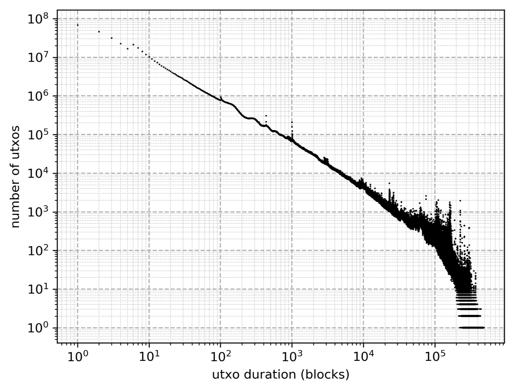
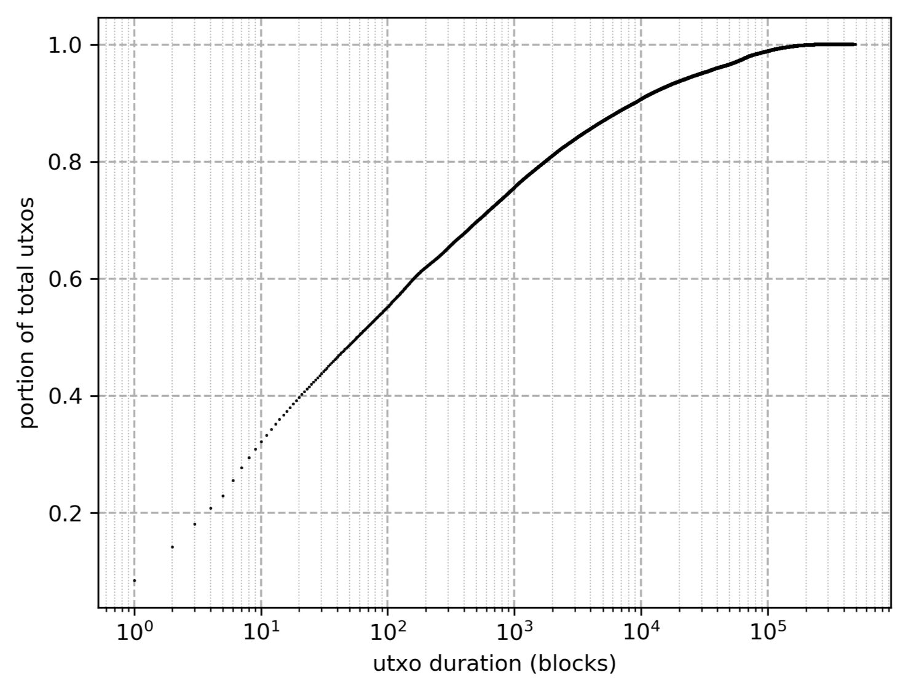
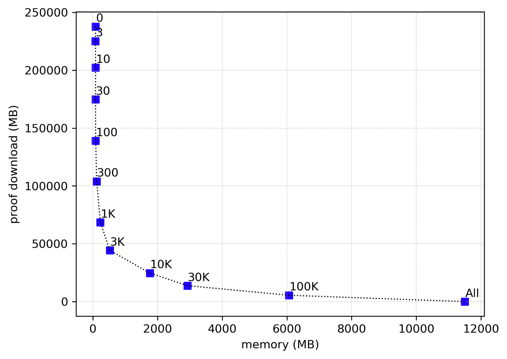

> Source: https://eprint.iacr.org/2019/611.pdf
# 5 Performance and Optimizations

## 5.1 Reducing proof length

While a single inclusion proof will be of log(n) size, we can send multiple simultaneous proofs in less space than sending each proof individually.
The size reduction depends on the proximity of the leaves to be proven.
Here are the two extreme examples: if two leaves are in different trees, there is no overlap in their proofs and two full-sized proofs are needed.
If, however, the leaves are adjacent, then no additional data is needed and the second inclusion proof is obtained for free.
When aggregating proofs, we send a sparse forest, covering every leaf to be proven, rather than a branch.
Proof branches are provided only up to the point where they intersect an already provided branch.
We can save even more space by omitting hashes that will be computed by the verifier; parent hashes can be omitted if both child hashes are contained in the proof.
In the extreme case, the proof for all the leaves in a tree is just the leaves themselves, as all intermediate hashes can be computed from the leaves.

In Bitcoin, transactions are aggregated into blocks in order to be confirmed via proof-of-work.
When compact state nodes propagate blocks, the existence of all UTXOs spent in the block (every input in the block) can be proven with a sparse forest.
In cases where single transactions are being sent, a sparse forest proving all inputs within a transaction can be sent along with the transaction.
To save bandwidth at the cost of some memory and complexity, clients can maintain their own sparse forest in memory.
When sending a transaction, nodes send only the positions of the UTXOs consumed.
Receiving clients then respond with a proof request, indicating which nodes in the forest are needed to get up to an intersection with nodes it already has in memory.

## 5.2 Short trees

As the trees are of different heights, the length of an inclusion proof is dependent on the tree in which the leaf to be proven resides.
Bitcoin’s UTXO set exhibits a power-law distribution of UTXO durations, or the length of time between when a UTXO is created and when it is deleted.
In fact, many UTXOs are created and destroyed within the same block, in which case we can ignore them as they have no effect on the accumulator.
Among UTXOs that do persist, many only last a few blocks, while some last for hundreds of thousands.
As we insert leaves into the forest on the right side, they will start off in the smaller trees, with shorter inclusion proofs.
UTXOs which have made their way to the larger trees on the left tend to have been around for thousands of blocks, and proofs in the larger trees will be less frequent.
The short-duration UTXOs will be added into short trees to the right and will be removed using smaller proofs, often with many adjacent leaves being deleted in the same block, which further reduces proof sizes.

## 5.3 Forest Caching Space/Space Trade-off

A node implementing the Utreexo accumulator can fully verify all inclusion proofs by storing only the roots of each tree in the forest, which on average is log(n)/2 hashes.
The additional size of the inclusion proofs can be significant when initially synchronizing to the blockchain – if proofs are naively added to every transaction input, their size exceeds that of the transactions themselves.

The simplest way to reduce proof sizes is to eliminate redundant data among multiple proofs.
Sending a sparse forest which simultaneously proves all inputs within a block, as described above, gives us the first significant space reduction.

Further proof size reductions can be achieved due to the redundancy of temporally rather than spatially distinct proofs.
As noted above, many UTXOs persist only for a short duration.
In the case where a UTXO persists for only a single block, the prover would be sending data that was known to (in fact computed by) the verifier just a single block prior.
(In IBD scenarios, this could be a fraction of a second.) If the verifier had kept all the hash tree information they computed from the last block, they would not need proofs for these short-lived UTXOs.

While the idea of keeping extra data from the forest (which takes up space) seems counter to the point of using an accumulator (to take up less space), there are good reasons to do this.
Without the ability to store and

> Figure 2: Distribution of UTXO duration in the Bitcoin blockchain.
Short lifetimes are very common, and durations of 0 blocks even more so.
0duration UTXOs are not displayed as they do not affect the accumulator (and don’t fit on a log-scale x-axis).
Note the distinct peaks at block durations of 6, 100, 433, and 1000.
The 100 block delay for coinbase TXOs is a consensus rule, while the other peaks are likely due to user preferences and behavior.

remember parts of the forest, using an accumulator is all-or-nothing where the choices are to either run a traditional node with a database storing the entire UTXO set or an accumulator node with only a few hashes for tree roots.
With the ability to store parts of the forest, this choice becomes a gradient, allowing users to select the memory vs.
bandwidth trade-off they wish to make.

At one extreme of this gradient, nodes minimize storage and memory requirements, keeping only the roots of the hash trees, which never exceed a kilobyte.
At the other extreme, nodes cache the entire hash forest and do not need downloaded proofs at all, just like a node with the full UTXO set (this is in fact a bridge node).
Between these two extremes, there is a gradual trade-off between network traffic and in-ram or on-disk storage.
The more of the forest a node caches, the smaller the proofs it will need to download.
Fortunately, due to the fact that transaction data exhibits a power-law distribution in the duration of UTXOs, this trade-off is not linear.
The first few megabytes of caching space give a large reduction in proof download size, after which there are diminishing returns as more memory is devoted to forest caching.
For the amounts of memory we would expect to see in low cost, widely used computing devices, the download overhead for IBD is quite reasonable.

> Figure 3: Fractional distribution of UTXO duration in the Bitcoin blockchain.
This is another view of the same data from Figure 2.
From this plot we can see that 40% of UTXOs last for 20 blocks or less, suggesting that a look-ahead cache of 20 blocks can reduce proof sizes by approximately 40%.

Another advantage of storing partial forest data is that non-root data is easily recoverable.
The partial forest data can be stored in volatile memory and not copied to persistent disk, with only the forest roots being maintained on disk.
A node can forget all forest data except for the accumulator roots

14 when it shuts down, and resume synchronization later.
The node will need to download additional data (the hashes forgotten) but will not have to backtrack in the synchronization process.

## 5.4 What to cache

When a client is performing IBD and decides to cache some portion of the forest data, what should they retain, and what should they forget? A simple, but still fairly effective strategy would be to remember all leaves added to the forest until either they are removed, or some number of blocks (the look-back period) have passed, at which point they are forgotten.
Given the distribution of TXO lifetimes, a small look-back period can significantly reduce the sizes of proofs.

Look-back caching is sub-optimal, however, as it would store many nodes for a period and then forgot them before they are used.
The space these nodes took up was wasted, as they displaced other nodes which could have potentially reduced proof sizes.
While this problem is generally unavoidable in caching algorithms, we can prevent this from happening completely in the case of IBD.
The server which stores the blocks and inclusion proofs is already fully synchronized, and for every TXO created, it knows in which block (if any) that TXO is consumed.
(For TXOs still in the UTXO set, the server considers that block to be “never”.) Servers can send this time to live (TTL) value to the synchronizing client as a hint, allowing the client to cache look-ahead nodes rather than look-behind nodes.
This also removes the need for the client to keep track of the insertion time of the cached leaves, as leaves are eliminated from memory only when the TXO is spent, and never from cache eviction.

The look-ahead caching is dependent on the cooperation of the IBD server.
While this server provides a hint of the UTXO’s TTL, the server does not provide any cryptographic proof for it.
Such a proof could be constructed using SPV proofs of transactions spending the TXO.
Unfortunately the size of such proofs would offset all download savings from the look-ahead, defeating the purpose of sending them.
While the IBD node is “trusted” to give TXO TTL hints, this trust is only for an optimization, and the worst a malicious IBD server can do is cause the client to cache leaves inefficiently, resulting in higher network transfer sizes (which the server also suffers itself).
A client could perform spot checks on the hints the server provides and disconnect from a server providing erroneous information.

IBD presents an unusual optimization scenario in that not only are TXO TTLs known ahead of time, but TXO arrivals are known before they happen as well.
In fact, the entire sequence of TXO insertion and removal is fully known at the outset of the IBD process.
Thus for a given amount of memory there is a deterministic, optimal caching schedule which can be precomputed.
The caching schedule can be represented as a single bit for every TXO, with 0 meaning “immediately forget” and 1 meaning “remember until spent”.
We anticipate that the optimal selection algorithm in [10] can be effectively applied to reduce the proof sizes for IBD beyond the reductions provided by look-ahead caching.
These caching schedules will be of reasonable size (on the order of 100MB) and are likely amenable to standard compression algorithms, unlike most of the data we deal with here, such as hashes and signatures.

We have left implementation of the clairvoyant cache scheduling for later work.
We have implemented the simpler look-ahead caching to measure network traffic requirements for IBD, as detailed below.
While implementing this caching strategy we observe that a fixed block look-ahead, while better than look-behind, is sub-optimal, and thus there may still be room for significant space savings.
One easily observed deficiency is the highly variable amount of memory used.
Client machines generally have a fixed amount of memory to be used for running Bitcoin, which would ideally be full, or close to full, at all times.
In the early blocks of Bitcoin’s blockchain, there are few transactions, and many blocks with no TXOs consumed at all.
Thus clients with, for example, 100MB to dedicated to caching are using only a small fraction of that in the first half of the IBD process.
Even in later blocks with higher transaction rates, there is still significant variability in memory usage for a fixed look-ahead strategy.

## 5.5 Measuring Performance

We implemented a Utreexo library and IBD simulator.
This simulator iterates through the Bitcoin blockchain up to block 546000, adding and removing TXOs from the accumulator.
We used blake2b as our hash function, and wrote the implementation in Go, compiled with go1.10.4 linux/amd64.
Simulations were run on a machine with an AMD Ryzen 7 1700 processor and 32GB of RAM, running Ubuntu 18.04.
Our implementation is publicly available at [11].

Given the power-law-like distribution of UTXO TTLs, we would expect a similar curve for download size as cache sizes increase, and our observed performance is in keeping with this expectation.
We measured peak memory usage for the entire program, and had a minimum memory usage of approximately 80MB (likely due to database and other runtime memory usage).
Due to this fixed overhead, very small lookahead values of 1, 3, or 10 blocks do not seem useful.
Given that memory usage will be at least 80MB (and likely more for a real, rather than simulated node) saving a few megabytes of cache memory is undetectable, while the increase in download size is significant.

> Figure 4: IBD proof size vs cache size.
Labels on the points are the number of look-ahead blocks.

As we increase cache sizes, we see diminishing returns, and it takes nearly 12GB of memory to completely eliminate all proof downloads.
With settings of this size the Utreexo design might seem superfluous as well – no proofs are ever given, and the client is storing the entire forest, which is larger than the standard UTXO set database.
There are still advantages however, in that this node keeps the forest in volatile memory, only writing the tree roots to disk.
There may be machine configurations with large amounts of volatile memory but limited non-volatile storage I/O.

With moderate amounts of memory, caching offers significant improvements for lower-end hardware with mechanical hard drives.
A low-cost laptop with 4GB of RAM and a 500GB mechanical drive can use a lookahead value of 1000 blocks, which uses 234MB of RAM and gives an IBD download overhead of about 33%.
We hope to bring this overhead down in the future with improved caching techniques.

## 5.6 Hardening against collision attacks

In addition to better caching techniques, another promising method to reduce proof sizes is to reduce the length of individual hash outputs.
At first glance, truncating hashes may seem unsafe, but Bitcoin offers a unique environment which can help mitigate collision attacks on reduced length hashes.

As an attacker (especially a miner) has significant control over the accumulator’s Merkle forest, one might expect that a collision-resistant hash function is required to prevent the attacker from creating invalid proofs (inclusion proofs for elements not previously added).
In Bitcoin’s case, however, we can make collision attacks infeasible, such that an attacker would instead need to perform a second preimage attack.

We assume an attacker who also is able to mine a block, and thus influence a number of leaf insertions, their positions, and the data they contain.
The simplest attack would be to create TXOs txo and txo' , where h(txo) = h(txo' ).
txo is an output from a valid transaction which all nodes on the network will confirm, while txo' is a made-up output of a million bitcoins that is not part of any valid transaction.
The attacker can then provide an inclusion proof for txo' , and spend the million bitcoins even though only txo has been inserted into the accumulator.

As the attacker is able to freely create both txo and txo' , the attacker can mount a collision attack, which takes on the order of 2n/2 computations, where n is the bit-length of the hash output.
If we can restrict the attacker’s ability to create either side of the collision (the hash being inserted or the hash being falsely proven) this attack is no longer feasable.

To prevent such an attack, we require that the data inserted into the accumulator be not just the hash of a TXO, which is controllable by the attacker, but instead the concatenation of the TXO data with the block hash in which the TXO is confirmed.
The attacker does not know the block hash before the TXO is confirmed, and it is not alterable by the attacker after confirmation (without significant cost).
Verifiers, when inserting into the accumulator, perform this concatenation themselves after checking the proof of work of the block.
Inclusion proofs contain this block hash data so that the leaf hash value can be correctly computed.

This additional data thwarts collision attacks as the attacker needs to find a block (which currently takes more than 2 70 hash operations) to create a single txo.
txo' can still be iterated through rapidly, as the attacker can use any previously computed block hash in their proof of txo' .
The number of operations required to mount a collision attack when attempts on one side are more difficult can be computed by

where d is the difficulty exponent, n is the size of the hash output in bits, and s is the resulting security against collisions.
For collision attacks on 256-bit hashes, with 270 work required on one side, this would give 2163 operations for a collision.

A second preimage attack, where txo is fixed and txo' alone can be iterated through, would seem to need 2256 operations to succeed.
However, the attacker doesn’t need to collide with txo, but can in fact collide with any leaf present in the accumulator.
This means the attack gets easier as the accumulator becomes larger; for 232 elements, the attack takes 2192</sup.> attempts.

The security gain from mitigating collision attacks can be used to decrease the proof size by truncating the output length of all hashes computed.
For a 2128 security parameter, and an anticipated UTXO set size of 232 or fewer, we estimate that hash outputs of 186 bits would suffice.
This would result in a 27% reduction in proof size with minimal complexity.
However, if the UTXO set increases, security could be degraded as second preimage attacks become easier to mount.
Once hashes are truncated, it’s not possible to retroactively increase the output size, and instead the accumulator would need to be rebuilt from scratch with larger hash outputs.
Additionally, the proof-of-work required to create a block in Bitcoin can decrease, which would also erode the protection from collisions the block hash provides.

Further protection from untargeted second preimage attacks may be gained by also committing to the leaf’s position in the leaf data.
In this case the leaves would be of the form h(txo||blockHash||position), where position is the integer index of the leaf position.
This would require the attacker to select a single leaf to target for colliding instead of allowing the attacker to collide with any leaf in the forest.
However, this technique is not applicable to our construction as leaves within the forest move due to deletions, and thus the position data salted into the hash will generally differ from the leaf position when the leaf is removed.
The complexity of tracking leaf movements seems to overwhelm any savings from this technique, but we mention this idea as a different accumulator construction, possibly closer to that in [8] may allow for fixed leaf positions and shorter proofs while still being secure.

# Reference
[8] Leonid Reyzin and Sophia Yakoubov. Efficient asynchronous accumulators for distributed pki. Cryptology ePrint Archive, Report 2015/718, 2015. https://eprint.iacr.org/2015/718.

[10] Laszlo A. Belady. A study of replacement algorithms for a virtual-storage computer. IBM Systems journal, 5(2):78–101, 1966.

[11] MIT DCI. Utreexo implementation. https://github.com/mit-dci/ utreexo, 2019.