> Source: https://eprint.iacr.org/2019/611.pdf
# 7 Appendix

# 7 附录

## 7.1 Batch deletion process

## 7.1 批量删除过程

The following is a description of the batch deletion process. While the single element deletion process is sufficient and can be invoked repeatedly, it is inefficient to do so. When many deletions occur simultaneously we can significantly reduce the number of hash operations needed to remove elements from the accumulator by batching the deletions.

以下是批量删除过程的说明。
尽管单个元素的删除过程已经够用，
并且可以重复调用，但这样做的效率很低。
当大量的删除操作同时发生时，
我们可以通过批量删除来显著减少从累加器中删除元素时所需的哈希操作。

Similar to the DeleteOne() function, the process for deleting many elements operates a row at a time, climbing from the bottom to the top of the forest. At each row, the same phases are followed. The data operated on at each row, includes the known hashes and their positions, as well a list of which locations to delete. The phases are, in order: “Twin”, or twin extraction, “Swap”, or sibling swapping, “Root”, promoting a node to or demoting a node from a root position, and “Climb”, ascending to the next row up. These 4 phases are described with accompanying diagrams. In the following diagrams, green nodes are nodes which are always known, as they are or were tree roots. Pink nodes are nodes which are being deleted.

与DeleteOne()函数类似，
删除多个元素的过程一次操作一行，
从森林的底部爬升到顶部。
每一行执行相同的运行阶段。
在每一行上操作的数据包括已知的哈希及其位置，
以及要删除的元素的位置列表。
运行阶段依次为：
“双胞胎”或“双胞胎提取”；
“交换”或同级交换；
“根”，将节点提升到根位置或从根位置降级；
以及“爬升”，升至下一行。
这四个阶段将通过附图进行描述。
在下图中，绿色节点始终是已知的，
因为它们是或曾经是树根。
粉色节点是要删除的节点。

## 7.2 Twin

## 7.2 双胞胎

While the twin step is optional, we can save time from the next step by immediately dealing with “twin” deletions; we define a twin deletion as a deletion where both the left and right sibling have been deleted. If we have a sorted list of locations to be deleted, a simple way to find these is to check if the next deletion is equal to the current deletion bitwise or’ed with 1. If so, we can remove both “twins” from the deletion list, and add the parent position to the next higher row of deletions to process.

尽管双胞胎步骤是可选的，
但我们可以通过立即处理“双胞胎”删除来节省下一步的时间。
我们将双胞胎删除定义为左兄弟和右兄弟都要删除的操作。
如果我们有要删除的位置的顺序列表，
那么找到双胞胎删除的简便方法是检查下一个删除的位置是否等于当前的删除位置按位或1。
如果是的话，就可以从删除列表中删除这两对“双胞胎”，
然后将父职位添加到要处理的下一个较高的删除行中。

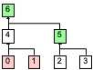

> Figure 5: Twin phase; nothing moves, and 4 is marked for deletion.

> 图5：双胞胎阶段；没有任何元素被移动，节点4被标记为删除。

## 7.3 Swap

## 7.3 交换

While there are 2 or more deletion positions left in the list, we iterate through them. Call the two positions deletionA and deletionB.

如果列表中还有2个或更多的元素位置待删除，
我们会对其进行遍历。
称这两个位置为deletionA和deletionB。

Move the hash at deletionB ⊕ 1 to deletionA. When moving a node, all the node’s children move with it. The parent of deletionB is added to the deletion list for the next row, and both deletionA and deletionB are removed from the current list. Note that in all cases we know the hash at deletionB⊕1, as it is the sibling of something being deleted (or the sibling of a parent of something being deleted) and thus is given to us in the inclusion proof.

将deletionB ⊕ 1位置的哈希移动到deletionA。
移动节点时，该节点的所有子节点都随之移动。
deletionB的父亲将被添加到下一行的删除列表中，
并且deletionA和deletionB都将从当前列表中被删除。
请注意，无论何时我们都知道在deletionB⊕1处的哈希，
因为它是某项被删除元素的兄弟（或某项被删除的父亲的兄弟），
因此包含证明会含有它们。

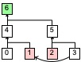

> Figure 6: Swap phase; deletionA is 1, deletionB is 2. 3 moves to 1, and 5 is marked for deletion.

> 图6：交换阶段；deletionA是1，deletionB是2。3被移动到1，5被标记为删除。

## 7.4 Root

## 7.4 根

If there are an even number of deletions on a row, the twin and swap phases will finish with no unpaired deletions, and the root phase is skipped. In cases where there are an odd number of deletions, however, the swap phase will finish with a single deletion remaining in the list. This final deletion is handled by the root phase.

如果一行里被删除的元素数目为偶数，
则双胞胎和交换阶段结束后，
不会留下还未配对的待删除元素，根阶段会被跳过。
但是，在删除数量为奇数的情况下，
交换阶段结束后，列表中还会剩下一个待删除元素。
最后一个删除操作由根阶段执行。

For every row in the forest, there either is or is not a tree with a root at that height. For example, in the forest of 133 leaves, there is a root at height 0, but there is no root at height 1. There is a root at height 2, and no roots for several rows above that.

对于森林中的每一行，
在该行所在高度都有一个或零个树根。
例如，在有133个叶子的森林中，
在高度0处有一个根，但在高度1处没有根。
在高度2处有一个根，在此之上的几行都没有根。

If we are on a row where a root is present, we move that root into the position of the remaining deletion, clear the deletion and are then finished with that row, adding no deletions for the next row. If a root is absent, we move the sibling of the deletion (position ⊕ 1) to the root position for this height, creating a new tree in the forest, and leaving a twin pair of deletions. We then mark the parent of the final deletion for deletion in the next row.

如果我们当前所处的行高度上出现了一个根，
则将该根移动到剩余被标记为删除的位置，
覆盖被标记为删除的元素，然后结束该行，
不给下一行添加任何删除标记。
如果这一行的高度没有根，
那就将被标记为删除的位置的兄弟（位置⊕1）移动到该高度的根位置，
在森林中创建一棵新树，并留下一对双胞胎删除。
然后，将最后一个删除位置的父亲标记为留到下一行删除。

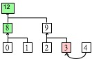

> Figure 7: Root phase with root present; 4 is demoted from a root to the sibling of 2.

> 图7：出现了树根的根阶段；4从树根被降级为2的兄弟。

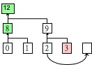

> Figure 8: Root phase with root absent; 2 is promoted to root of the height 1 tree.

> 图8：没有出现树根的根阶段；2被升级为高度为1的树的根。

## 7.5 Climb

## 7.5 爬升

When the root phase has finished, the climb phase transitions between levels of the forest. All deletions will be in pairs of two deleted siblings. The parent nodes of all deleted sibling pairs are marked as deleted, and parents of nodes which moved in the swap or root phase are recomputed. When the deletion and hashing are finished, the per-row phases (starting with twin) begin on the next level up.

当根阶段结束时，
爬升阶段会在森林的各个层之间进行迁移。
所有的待删除元素将以成对的被删除兄弟出现。
我们会将所有已删除的双胞胎兄弟的父节点标记为已删除，
并且为交换或根阶段移动的节点重新生成父节点。
完成删除和哈希操作后，就上升到下一行，
从双胞胎阶段重新执行四个阶段。

When the top of the forest is reached, the deletion process is finished. If a row is reached with no deletions, the process can terminate early.

当到达森林的顶部时，删除过程完成。
如果到达某一行没有出现删除，则该过程可以提前终止。

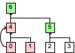

> Figure 9: Climb phase; Begin a new deletion list from positions marked in the previous other 3 phases and climb to the next row.

> 图9：爬升阶段；
从前三个阶段中标记的位置开始构造一个新的删除列表，
然后爬升到下一行。

## 7.6 Integrated batched deletion example

## 7.6 一个完整的批量删除例子

In this example, there are 8 leaves in a single tree. Leaves 5 and 6 are being deleted. An inclusion proof for both 5 and 6 is provided. Note that an inclusion proof for these nodes does not contain any nodes from the 2nd row, as both 10 and 11 are computable from data known in the first row.

在这个例子中，一棵树上有8个叶子。
第5和第6个叶子正被删除。
我们提供了5和6的包含证明。
请注意，这些节点的包含证明不包含第二行中的任何节点，
因为10和11均可从第一行中已知的数据中计算得出。

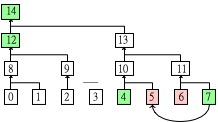

> Figure 10: There are no twins, so first 7 is swapped with 5

> 图10：没有双胞胎，所以首先将7和5交换。

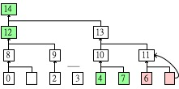

> Figure 11: The bottom row is finished and 11 is marked for deletion as its children are gone. 10 is computed.

> 图11：最底下一行已经结束，11被标记为删除，因为它的孩子都没了。10被重新生成。

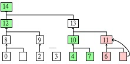

> Figure 12: On the second row, there are no twins, and we cannot swap, so we proceed directly to root.

> 图12：第二行没有双胞胎，并且无法做交换，因此直接进入根阶段。

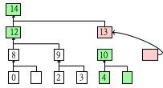

> Figure 13: 10 becomes the root of its own tree, leaving 13 to be deleted as well.

> 图13：10变成它自己的树的根，留下13待删除。

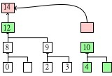

> Figure 14: 14 is deleted as 12 becomes the root of its tree.

> 图14：14被删除，因为12变成了它自己的树的根。

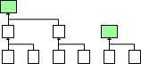

> Figure 15: The final forest state after deletion is complete.

> 图15：删除操作结束后的最终森林状态。
